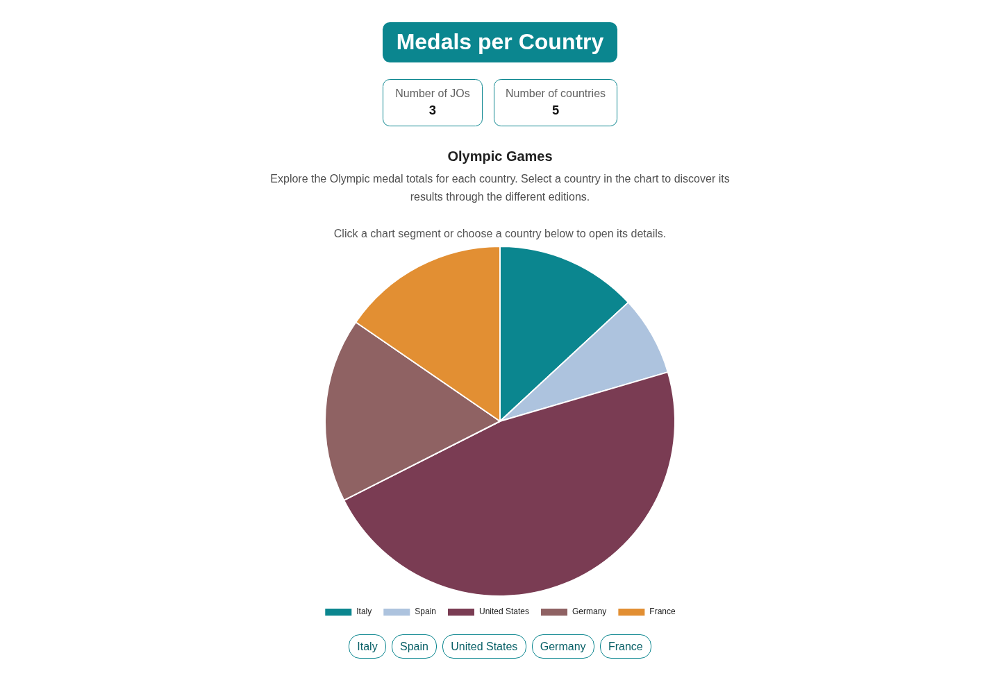
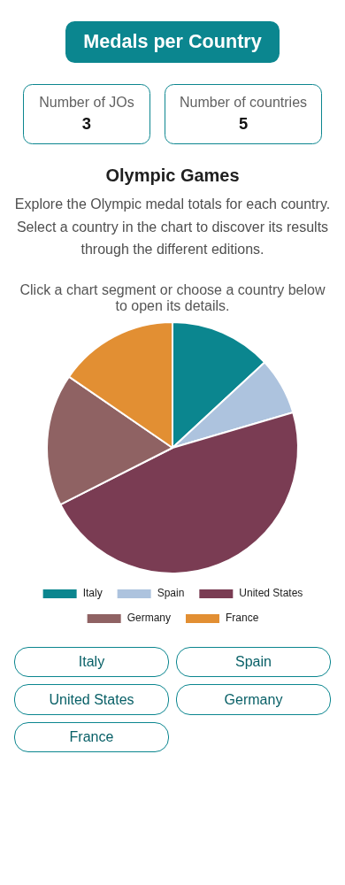
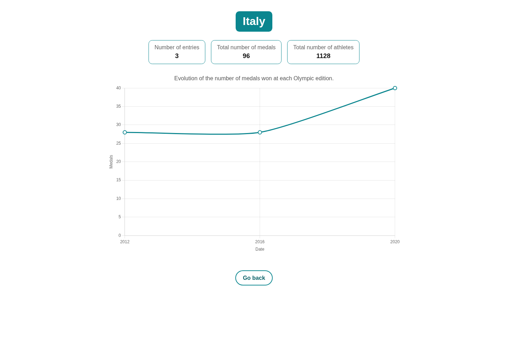
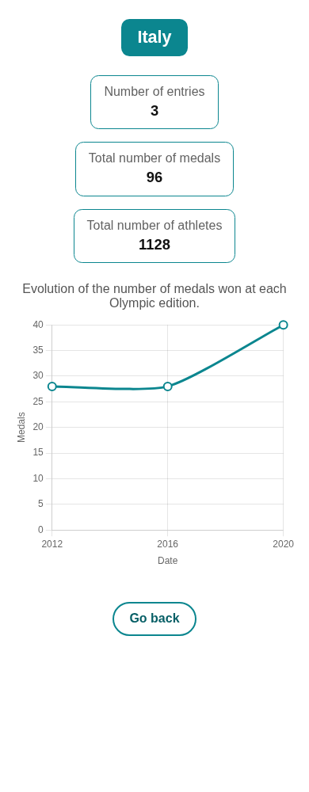

# TéléSport — Jeux olympiques

Application front-end Angular permettant de consulter les totaux de médailles
olympiques par pays et l'évolution des résultats d'un pays sélectionné.

Ce projet a été réalisé dans le cadre du parcours OpenClassrooms « Définissez
et développez le front-end en utilisant du code Angular maintenable ».

## Sommaire

- [Fonctionnalités](#fonctionnalités)
- [Captures d'écran](#captures-décran)
- [Prérequis](#prérequis)
- [Installation](#installation)
- [Commandes](#commandes)
- [Routes](#routes)
- [Architecture](#architecture)
- [Gestion des données et des erreurs](#gestion-des-données-et-des-erreurs)
- [Responsive et accessibilité](#responsive-et-accessibilité)
- [Tests réalisés](#tests-réalisés)
- [Documentation](#documentation)

## Fonctionnalités

- dashboard présentant le nombre de pays et d'éditions olympiques ;
- graphique circulaire des médailles cumulées par pays ;
- navigation vers le détail au clic sur un secteur ou un bouton de pays ;
- page détail avec participations, médailles et athlètes ;
- graphique d'évolution des médailles par édition ;
- retour vers le dashboard ;
- états de chargement, absence de données et erreur ;
- redirection des routes et identifiants inconnus vers une page 404 ;
- interface adaptée au mobile, à la tablette et au desktop.

## Captures d'écran

### Dashboard

| Desktop — 1 440 px | Mobile — 390 px |
|---|---|
|  |  |

### Détail d'un pays

| Desktop — 1 440 px | Mobile — 390 px |
|---|---|
|  |  |

[Télécharger l'archive ZIP des quatre captures](docs/telesport-ui-screenshots.zip).

## Prérequis

- Git ;
- Node.js `18.19.1` minimum, `20.11.1` minimum ou `22+` ;
- npm `8+` ;
- Chrome ou Chromium pour les tests Karma en mode headless.

Le projet utilise Angular CLI `18.2`. Une installation globale est facultative :
les commandes npm utilisent la version locale déclarée dans le projet.

## Installation

```bash
git clone https://github.com/msm-oc-projects/msm-projet-02-frontend.git
cd msm-projet-02-frontend
npm ci
```

Lancer ensuite le serveur de développement :

```bash
npm start
```

L'application est disponible par défaut sur
[`http://localhost:4200`](http://localhost:4200).

## Commandes

| Commande | Utilisation |
|---|---|
| `npm start` | lance le serveur Angular de développement |
| `npm run build` | génère le bundle de production dans `dist/tele-sport/` |
| `npm test` | lance Karma en mode interactif |
| `npm test -- --watch=false --browsers=ChromeHeadless --progress=false` | exécute la suite une fois en mode headless |

## Routes

| URL | Contenu |
|---|---|
| `/` | dashboard olympique |
| `/country/:id` | statistiques et évolution d'un pays |
| `/not-found` | page d'erreur |
| toute autre URL | redirection vers `/not-found` |

Exemple : `/country/1` affiche les données de l'Italie.

## Architecture

```text
src/app/
├── components/
│   ├── header/
│   ├── medal-evolution-chart/
│   └── medals-chart/
├── models/
│   ├── indicator.model.ts
│   ├── olympic.model.ts
│   └── participation.model.ts
├── pages/
│   ├── country-detail/
│   ├── dashboard/
│   └── not-found/
├── services/
│   └── data.service.ts
├── app-routing.module.ts
└── app.module.ts
```

Principes appliqués :

- les pages conteneurs orchestrent les données, les états et la navigation ;
- les composants de présentation reçoivent des entrées typées et émettent des
  événements métier ;
- `DataService` constitue l'unique façade d'accès aux données ;
- les flux sont composés avec RxJS et consommés par l'`async` pipe ;
- les composants graphiques encapsulent et détruisent leurs instances Chart.js ;
- les composants de présentation utilisent la détection de changements
  `OnPush`.

La description détaillée se trouve dans [ARCHITECTURE.md](ARCHITECTURE.md).

## Gestion des données et des erreurs

Les données simulées se trouvent dans `src/assets/mock/olympic.json`.
`DataService`, fourni avec `providedIn: 'root'`, les charge une seule fois et
expose des collections TypeScript en lecture seule.

L'URL de la source est définie par `olympicsUrl` dans les environnements
Angular. Le remplacement du JSON par une API REST peut donc être réalisé sans
modifier les composants d'interface.

Cas gérés côté utilisateur :

- chargement en cours ;
- liste vide ou participations absentes ;
- erreur de récupération avec un message non technique ;
- identifiant de pays invalide ou inconnu ;
- URL inexistante.

## Responsive et accessibilité

L'interface utilise une grille responsive :

- mobile jusqu'à `767px` : 4 colonnes et contenu empilé ;
- tablette de `768px` à `1199px` : 8 colonnes ;
- desktop à partir de `1200px` : 12 colonnes.

Les graphiques possèdent une description textuelle. Le dashboard fournit des
boutons accessibles en alternative au clic sur les secteurs. Les liens et
boutons disposent d'un focus visible et les erreurs sont annoncées avec des
rôles ARIA adaptés.

## Tests réalisés

La suite couvre notamment :

- le chargement et la recherche des données ;
- la construction des indicateurs ;
- la navigation par identifiant ;
- les composants de présentation ;
- l'identifiant invalide et le pays absent ;
- les données manquantes et l'erreur HTTP simulée ;
- la route générique et la page 404.

Le rendu a été vérifié dans Chrome aux largeurs `390px`, `1024px` et `1440px`.

## Documentation

- [Architecture finale](ARCHITECTURE.md)
- [Audit et décisions préparatoires](notes-architecture.md)
- [Archive des captures](docs/telesport-ui-screenshots.zip)
